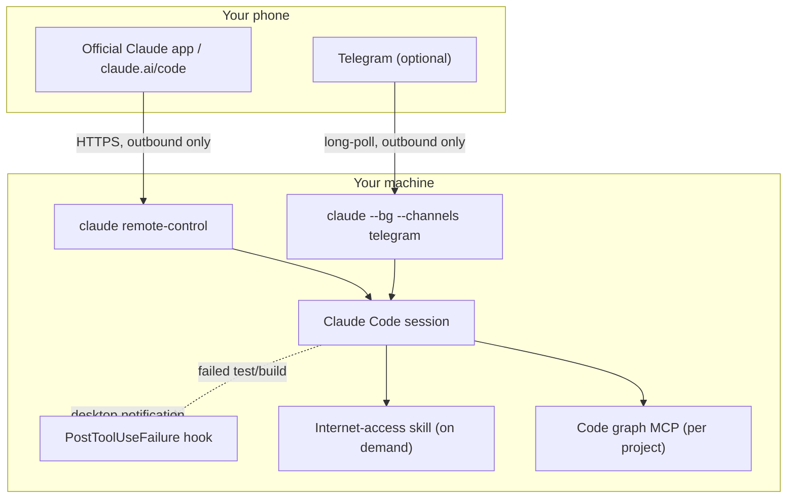

# claude-code-boost

**A lean, research-backed configuration layer for [Claude Code](https://code.claude.com) — deeper codebase understanding at a fraction of the tokens, and a way to run it unattended and steer it from your phone. No bloat, no bots you have to trust with your codebase, nothing that sits in your context unless it's actually earning its place.**

Most "supercharge your AI coding agent" setups work by throwing every MCP server, plugin, and framework they can find at the problem. This one doesn't. Every piece here was chosen after actually reading the competing implementations, benchmarking the claims, and rejecting anything that duplicated a feature Claude Code already ships natively or cost more context than it saved. The result is small on purpose.

## What you get

**Understand large codebases without reading them file-by-file.**
A local, zero-API-key code knowledge graph (tree-sitter + a persistent graph, not embeddings-as-a-service) answers structural questions — who calls this, what breaks if I change that, what's the architecture — in a few hundred tokens instead of tens of thousands. Scoped per project, never loaded globally, so it costs nothing in the projects that don't need it.

**Reach the parts of the internet Claude can't fetch natively.**
Native `WebFetch`/`WebSearch` stay the default for every generic page. A capability skill kicks in only for what they genuinely can't do: logged-in platforms, heavy-JS pages, video transcripts — installed as an on-demand skill, not a standing MCP tax on every session.

**Run Claude unattended on your machine, and drive it from your phone.**
Built entirely on Claude Code's *native* Remote Control and Channels features — no third-party bot server, no proxy, no exposed port. Start a session on your laptop, close the lid, and approve permissions, read progress, and send new instructions from the official Claude mobile app or a Telegram bot that only you (and whoever you explicitly allow) can talk to.

**Know when something actually needs you.**
A single scoped hook watches for failed test/build commands and fires a desktop notification — not a ping for every tool call, just the ones that matter.

**Quality-of-life without the ceremony.**
Two shell functions (`cproj`, `ctel`) turn "open a project and make it reachable from my phone" into one command instead of a memorized ritual of flags.

## Why this and not the alternatives

This project exists because the obvious alternatives were evaluated and rejected for specific, checkable reasons:

| Instead of... | This uses | Because |
|---|---|---|
| A second competing code-graph MCP | One code-graph MCP, scoped per project | Two tools solving the same problem doubles the fixed context cost for zero benefit |
| A custom-built Telegram bot | Claude Code's official `Channels` plugin | Anthropic owns the attack surface, not a random maintainer; ships a real request-ID + allowlist approval protocol instead of parsing terminal text |
| `tmux`-based session orchestration | Claude Code's native `--bg` / `claude agents` | Structured session state (working/needs-input/completed/failed) instead of screen-scraping a TUI for spinners |
| A paid Agent SDK integration | The Claude Code CLI directly | The SDK bills per token via API key; the CLI uses the subscription you're already paying for |
| Ads/sponsored messages in the terminal | Nothing | Investigated seriously — no legitimate model exists for a personal setup without third-party install volume, and the only technical mechanism to inject content costs real tokens on every use |

Full writeups of what was compared and why live in `docs/`.

## Architecture



Nothing here opens an inbound port. Both mobile paths are outbound connections initiated by your machine or by Telegram's own servers polling your bot — there is nothing on the public internet pointed at your PC.

## Quickstart

```bash
git clone https://github.com/adro0303/claude-code-boost.git
cd claude-code-boost
./install.sh
```

The installer is interactive and asks before touching anything optional. It always:
- Installs the build/test-failure notification hook
- Wires `cproj` / `ctel` into your shell

It only installs the code-graph MCP or the internet-access skill if you say yes, and it never overwrites your existing `~/.claude/settings.json` or `~/.claude/CLAUDE.md` — it merges in what's missing.

### Connect your phone (native Remote Control, no setup)

```bash
cd ~/Projects/your-project
claude remote-control
```

Open the **Code** tab in the official Claude mobile app, or visit `claude.ai/code` — the session shows up automatically. Approvals, progress, and completion all surface natively in the app.

### Connect Telegram (optional)

1. Message [@BotFather](https://t.me/BotFather) on Telegram, send `/newbot`, copy the token.
2. `claude plugin install telegram@claude-plugins-official`
3. Inside a Claude Code session: `/telegram:configure <token>`
4. `claude --channels plugin:telegram@claude-plugins-official`
5. Message your bot from your phone — it replies with a pairing code.
6. `/telegram:access pair <code>`, then `/telegram:access policy allowlist` to lock it down to just you.

From then on, `ctel <project-name>` moves the bot to whichever project you're working on.

## Configuration reference

- [`CLAUDE.md.example`](./CLAUDE.md.example) — tool-preference rules to merge into your own `CLAUDE.md`
- [`hooks/build-test-alert`](./hooks/build-test-alert) — the notification hook, read it before you trust it
- [`shell/aliases.zsh`](./shell/aliases.zsh) — `cproj` / `ctel`
- [`.env.example`](./.env.example) — the only environment variables this repo cares about

## Security notes

- Nobody but you can talk to the Telegram bot by default (`dmPolicy: allowlist`, checked by sender ID, not chat/group ID).
- Anyone you *do* allow through the channel can approve or deny permission prompts in the session it's attached to — that's real control over what Claude does on your machine, not a read-only chat. Grant it accordingly.
- Secrets (the bot token) are never stored in this repo or in the hook script — they live in `~/.claude/channels/telegram/.env`, `chmod 600`, or your own shell environment.
- The notification hook only ever inspects the command string of a failed Bash call and prints a notification; it has no `allow`/`deny` authority and cannot approve anything.

## Acknowledgments

This project configures and connects existing tools rather than reinventing them. Full credit and license details for everything it depends on are in [`THIRD_PARTY_NOTICES.md`](./THIRD_PARTY_NOTICES.md) — in short: [DeusData/codebase-memory-mcp](https://github.com/DeusData/codebase-memory-mcp) (MIT), [Panniantong/Agent-Reach](https://github.com/Panniantong/Agent-Reach) (MIT), and Anthropic's [claude-plugins-official](https://github.com/anthropics/claude-plugins-official) (Apache-2.0) and [Claude Code](https://code.claude.com) itself.

## License

MIT — see [`LICENSE`](./LICENSE). This covers the original code in this repository (hooks, shell scripts, docs); it does not relicense the third-party projects it installs.
