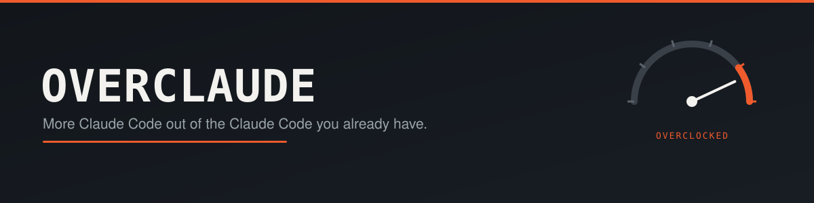
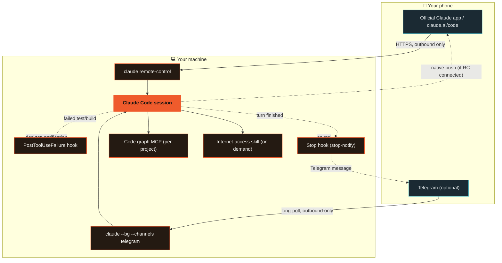

<p align="center">
  
</p>

<p align="center">
  <a href="./LICENSE"></a>
  <a href="https://code.claude.com"></a>
  <a href="./install.sh"></a>
  
  <a href="https://github.com/adro0303/overclaude/pulls"></a>
</p>

**Push [Claude Code](https://code.claude.com) past its factory settings: read entire codebases for pocket change in tokens, run it unattended, and drive it from your phone — without bolting on a single MCP, bot, or byte of context that isn't earning its keep.**

Overclocking a CPU means squeezing more performance out of hardware you already own, without replacing it. That's the whole idea here — no forked runtime, no rewritten agent loop, no subscription to something else. Just Claude Code, configured properly, running closer to its limit.

Most "supercharge your AI agent" setups get there by throwing every MCP server, plugin, and framework they can find at the problem — and quietly pay for it in a context window that's half boilerplate before you've typed a word. Overclaude does the opposite. Every piece here survived a fight: five to nine competing implementations were cloned, read, and benchmarked per category before anything got a place in this repo. What didn't clearly win got cut, no matter how impressive the marketing.

<table>
<tr><td width="20%"><b>🧠 Codebase graph</b></td><td>Structural answers in ~100s of tokens, not tens of thousands</td></tr>
<tr><td><b>🌐 Reach beyond the web</b></td><td>Logged-in sites, transcripts — only when native fetch can't</td></tr>
<tr><td><b>📱 Pocket control</b></td><td>Official mobile app + optional Telegram, zero exposed ports</td></tr>
<tr><td><b>🔔 Signal, not noise</b></td><td>One hook, fires only when a test/build actually breaks</td></tr>
<tr><td><b>⚡ One-command switch</b></td><td><code>cproj</code> / <code>ctel</code> instead of a flag ritual</td></tr>
</table>

## 🧠 What it actually does

**Understand large codebases without reading them file-by-file.**
A local, zero-API-key code knowledge graph (tree-sitter + a persistent graph, not embeddings-as-a-service) answers structural questions — who calls this, what breaks if I change that, what's the architecture — in a few hundred tokens instead of tens of thousands. Scoped per project, never loaded globally, so it costs nothing in the projects that don't need it.

**Reach the parts of the internet Claude can't fetch natively.**
Native `WebFetch`/`WebSearch` stay the default for every generic page. A capability skill kicks in only for what they genuinely can't do: logged-in platforms, heavy-JS pages, video transcripts — installed as an on-demand skill, not a standing MCP tax on every session.

**Leave it running. Drive it from your pocket.**
Built entirely on Claude Code's *native* Remote Control and Channels features — no third-party bot server, no proxy, no exposed port. Close your laptop mid-task and approve permissions, read progress, and send new instructions from the official Claude mobile app, or a Telegram bot that only the people you name can talk to.

**Get pinged for what matters, not everything.**
One scoped hook watches for failed test/build commands and fires a desktop notification — not a ping for every tool call Claude makes, just the ones that actually need you.

**Know the moment it's done, wherever you are.**
A `Stop` hook fires a completion sound and a short Telegram message (with a preview of the last response) the instant a turn finishes. Combined with `agentPushNotifEnabled`, Claude can also push straight to the official mobile app's native notification channel once Remote Control is connected — no extra bot, no extra token, reuses the Telegram pairing you already did above.

**Zero-ceremony project switching.**
Two shell functions, `cproj` and `ctel`, turn "open this project and make it reachable from my phone" into one command instead of a memorized ritual of flags.

## ⚖️ Why this and not the alternatives

Overclaude exists because the obvious alternatives were tried and rejected for specific, checkable reasons — not vibes:

| Instead of... | Overclaude uses | Because |
|---|---|---|
| A second competing code-graph MCP | One code-graph MCP, scoped per project | Two tools solving the same problem doubles the fixed context cost for zero benefit |
| A custom-built Telegram bot | Claude Code's official `Channels` plugin | Anthropic owns the attack surface, not a random maintainer; ships a real request-ID + allowlist approval protocol instead of parsing terminal text |
| `tmux`-based session orchestration | Claude Code's native `--bg` / `claude agents` | Structured session state (working / needs-input / completed / failed) instead of screen-scraping a TUI for spinners |
| A paid Agent SDK integration | The Claude Code CLI directly | The SDK bills per token via API key; the CLI uses the subscription you're already paying for |
| Ads/sponsored messages in the terminal | Nothing | Investigated seriously — no legitimate model exists for a personal setup without third-party install volume, and the only technical mechanism to inject content costs real tokens on every use |

Full writeups of what was compared and why live in [`docs/`](./docs).

## 🏗️ Architecture



Nothing here opens an inbound port. Both mobile paths are outbound connections initiated by your machine or by Telegram's own servers polling your bot — there is nothing on the public internet pointed at your PC.

## 🚀 Quickstart

```bash
git clone https://github.com/adro0303/overclaude.git
cd overclaude
./install.sh
```

The installer is interactive and asks before touching anything optional. It always:
- Installs the build/test-failure notification hook
- Installs the turn-completion hook (sound + Telegram ping) and enables native mobile push notifications
- Wires `cproj` / `ctel` into your shell

It only installs the code-graph MCP or the internet-access skill if you say yes, and it never overwrites your existing `~/.claude/settings.json` or `~/.claude/CLAUDE.md` — it merges in what's missing.

### Connect your phone (native Remote Control, zero setup)

```bash
cd ~/Projects/your-project
claude remote-control
```

Open the **Code** tab in the official Claude mobile app, or visit `claude.ai/code` — the session shows up automatically. Approvals, progress, and completion all surface natively in the app.

### Connect Telegram (optional)

1. Message [@BotFather](https://t.me/BotFather) on Telegram, send `/newbot`, copy the token.
2. `claude plugin install telegram@claude-plugins-official`
3. Inside a Claude Code session: `/telegram:configure <token>`
4. `claude --channels plugin:telegram@claude-plugins-official`
5. Message your bot from your phone — it replies with a pairing code.
6. `/telegram:access pair <code>`, then `/telegram:access policy allowlist` to lock it down to just the people you approve.

From then on, `ctel <project-name>` moves the bot to whichever project you're working on.

Once Telegram is paired, `hooks/stop-notify` (installed automatically) reuses that same pairing to ping you when a turn finishes — nothing further to configure. Native mobile push additionally reaches your phone once a session was started with `claude remote-control` / `cproj`; the `agentPushNotifEnabled` / `inputNeededNotifEnabled` settings the installer sets just allow Claude to use that channel, they don't create the connection by themselves.

## 🔧 Configuration reference

- [`CLAUDE.md.example`](./CLAUDE.md.example) — tool-preference rules to merge into your own `CLAUDE.md`
- [`hooks/build-test-alert`](./hooks/build-test-alert) — the build/test-failure notification hook, read it before you trust it
- [`hooks/stop-notify`](./hooks/stop-notify) — the turn-completion hook (sound + Telegram ping), read it before you trust it
- [`shell/aliases.zsh`](./shell/aliases.zsh) — `cproj` / `ctel`
- [`.env.example`](./.env.example) — the only environment variables this repo cares about

## 🔒 Security notes

- Nobody talks to the Telegram bot by default except the account that set it up (`dmPolicy: allowlist`, checked by sender ID, not chat/group ID).
- Anyone you *do* allow through the channel can approve or deny permission prompts in the session it's attached to — that's real control over what Claude does on your machine, not a read-only chat. Grant it accordingly.
- Secrets (the bot token) are never stored in this repo or in the hook script — they live in `~/.claude/channels/telegram/.env`, `chmod 600`, or your own shell environment.
- The notification hook only ever inspects the command string of a failed Bash call and prints a notification; it has no `allow`/`deny` authority and cannot approve anything.
- `hooks/stop-notify` sends a short (150-char) preview of Claude's last response over Telegram to whoever is already in your channel's `allowFrom` allowlist — know that before you approve someone through pairing, since it's more than the build/test hook shares. Set `TELEGRAM_NOTIFY_CHAT_IDS` to narrow it to a subset if you pair more people than you want reading completion previews.

## Acknowledgments

Overclaude configures and connects existing tools rather than reinventing them. Full credit and license details for everything it depends on are in [`THIRD_PARTY_NOTICES.md`](./THIRD_PARTY_NOTICES.md) — in short: [DeusData/codebase-memory-mcp](https://github.com/DeusData/codebase-memory-mcp) (MIT), [Panniantong/Agent-Reach](https://github.com/Panniantong/Agent-Reach) (MIT), and Anthropic's [claude-plugins-official](https://github.com/anthropics/claude-plugins-official) (Apache-2.0) and [Claude Code](https://code.claude.com) itself.

## License

MIT — see [`LICENSE`](./LICENSE). This covers the original code in this repository (hooks, shell scripts, docs); it does not relicense the third-party projects it installs.

---

If Overclaude got your Claude Code doing more with less, a star helps other people find it.
