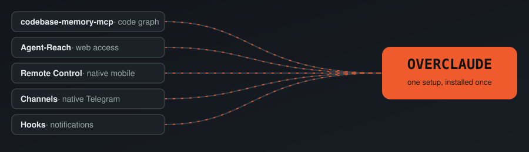
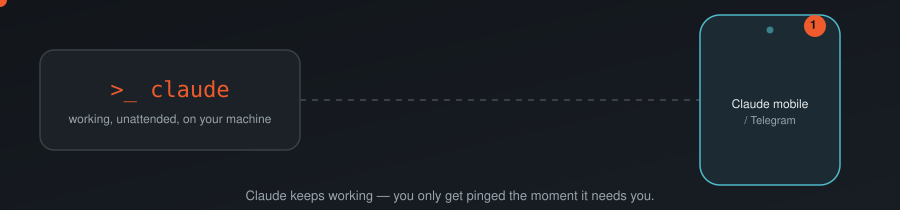
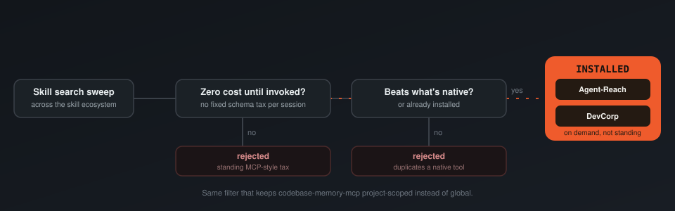
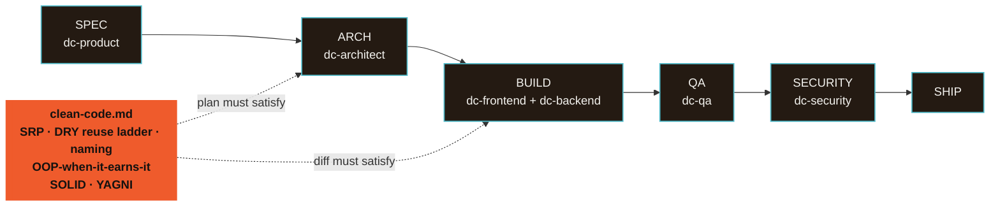
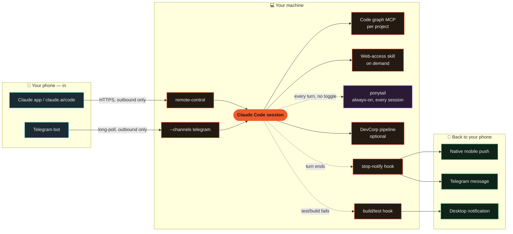

<p align="center">
  
</p>

<p align="center">
  <a href="./LICENSE"></a>
  <a href="https://code.claude.com"></a>
  <a href="./install.sh"></a>
  
  <a href="https://github.com/adro0303/overclaude/pulls"></a>
  <a href="#-support-nudge-opt-in-off-by-default"></a>
  <a href="./skills/devcorp/references/clean-code.md"></a>
  <a href="https://github.com/DietrichGebert/ponytail"></a>
</p>

**[Claude Code](https://code.claude.com)'s ecosystem has a dozen good ideas scattered across a dozen separate repos. Overclaude is what happens when the best of them get evaluated, stripped down, and wired into *one* setup you install once — instead of five things you'd have to find, compare, and glue together yourself.**

That's the whole project: not a new tool, a curation. Every serious improvement people bolt onto Claude Code today lives in its own repo, with its own install steps and its own tradeoffs — and several of them solve the exact same problem twice. Overclaude is the result of actually doing that comparison — cloning the candidates, reading the code, benchmarking the claims — and shipping only the pieces that won, pre-wired to work together.

<p align="center">
  
</p>

| What it does | Powered by |
|---|---|
| 🧠 Codebase knowledge graph | [`codebase-memory-mcp`](https://github.com/DeusData/codebase-memory-mcp) — chosen over Graphify after both were cloned and benchmarked |
| 🌐 On-demand internet access | [`Agent-Reach`](https://github.com/Panniantong/Agent-Reach) — installed as a skill, not a standing MCP |
| 📱 Mobile app control | Claude Code's native **Remote Control** — no bot required |
| 💬 Telegram control | Claude Code's native **Channels** plugin — official, not custom-built |
| 🔔 Smart notifications | Original hooks in this repo, built after `tmux`/`Orca`-style orchestration was ruled out |
| ✂️ Minimal, non-over-built code | [`ponytail`](https://github.com/DietrichGebert/ponytail) — YAGNI/reuse-ladder plugin, benchmarked -54% LOC / -22% tokens vs. no-skill baseline. 🟣 **The one skill here with a fixed always-on cost (~983 tok/session)** — every other piece loads on demand; kept anyway because the quality gain is measured, not assumed |
| 🏢 Multi-agent build pipeline | [`DevCorp`](./skills/devcorp) — original skill + 7 subagents, model-routed (haiku recon → sonnet build → opus plan/audit), gated on [clean code, OOP + SOLID, agile discipline, and a `ponytail`-adapted reuse ladder](./skills/devcorp/references/clean-code.md) |
| 💛 Support nudge | 🟣 **The one opt-in piece — OFF by default.** One line/week, straight to your terminal, zero tokens — see "Support nudge" below |

Full evaluation notes — what else was considered, and why it lost — are in [`docs/`](./docs) and [`THIRD_PARTY_NOTICES.md`](./THIRD_PARTY_NOTICES.md).

## ⚡ Efficient: less context, fewer tokens, sharper answers

**Understand large codebases without reading them file-by-file.**
A local, zero-API-key code knowledge graph (tree-sitter + a persistent graph, not embeddings-as-a-service) answers structural questions — who calls this, what breaks if I change that, what's the architecture — in a few hundred tokens instead of tens of thousands. Installed automatically, but wired into a specific project only past a file-count threshold (`cproj`/`ctel` do this the moment you open it) — never loaded globally, so it costs nothing in the projects that don't need it.

**Reach the parts of the internet Claude can't fetch natively.**
Native `WebFetch`/`WebSearch` stay the default for every generic page. A capability skill kicks in only for what they genuinely can't do: logged-in platforms, heavy-JS pages, video transcripts — installed as an on-demand skill, not a standing MCP tax on every session.

## ✂️ Clean: code that doesn't over-build

**Reach for what already exists before writing something new.**
[`ponytail`](https://github.com/DietrichGebert/ponytail) runs a 7-rung check before any new code gets written: does it need to exist → is it already in the codebase → does the stdlib do it → does the platform do it natively → does an installed dependency do it → does it fit in one line → only then, the minimum that works. Measured on real agentic sessions against a no-skill baseline: -54% LOC, -22% tokens, -20% cost, -27% time, with no drop on a separate adversarial safety score — validation, error handling, security, and accessibility stay non-negotiable at every rung. It's the one piece in this repo that trades a small fixed cost (~983 tok/session, every project) for that gain; see [How skills get chosen](#-how-skills-get-chosen-cost-has-to-earn-its-keep) for why that's a deliberate exception, not scope creep.

**DevCorp's build pipeline is gated on the same discipline.**
Every plan `dc-architect` writes and every diff `dc-frontend`/`dc-backend` produces has to satisfy [`clean-code.md`](./skills/devcorp/references/clean-code.md) — single responsibility, the same reuse ladder, OOP only when there's real state + behavior, SOLID once there's a real class or interface, and YAGNI against SPEC's actual acceptance criteria. A plan or diff that fails this isn't "done," same as one that fails a test isn't.

## 📱 Comfortable: leave it running, carry it in your pocket

<p align="center">
  
</p>

**Leave it running. Drive it from your pocket.**
Built entirely on Claude Code's *native* Remote Control and Channels features — no third-party bot server, no proxy, no exposed port. Close your laptop mid-task and approve permissions, read progress, and send new instructions from the official Claude mobile app, or a Telegram bot that only the people you name can talk to.

**Get pinged for what matters, not everything.**
One scoped hook watches for failed test/build commands and fires a desktop notification — not a ping for every tool call Claude makes, just the ones that actually need you.

**Know the moment it's done, wherever you are.**
A `Stop` hook fires a completion sound and a short Telegram message (with a preview of the last response) the instant a turn finishes. Combined with `agentPushNotifEnabled`, Claude can also push straight to the official mobile app's native notification channel once Remote Control is connected — no extra bot, no extra token, reuses the Telegram pairing you already did above.

**Zero-ceremony project switching.**
Two shell functions, `cproj` and `ctel`, turn "open this project and make it reachable from my phone" into one command instead of a memorized ritual of flags.

## 🤔 Why should you install this?

Every piece here had real competition, and Overclaude already ran the bake-off so you don't have to. A code-graph MCP, a way to talk to Telegram, a way to run multiple agents at once, a way to reach the API — each of those categories had several legitimate options, each option got cloned and actually tried, and only the one that won a head-to-head made it into this repo. Doing that yourself costs more than the five minutes `install.sh` takes — you just don't find out until later.

**You'd end up running two things that do the same job.** Whatever code-graph MCP you land on first, you'll eventually find a second one — and now both load their tool schema into every session, whether you're debugging a race condition or fixing a typo. Overclaude ships one, scoped to the project that actually needs it.

**You'd own a Telegram bot's security instead of Anthropic's.** Hand-rolling a bot means you're the one who decides how it stores tokens and who's allowed to talk to it. Overclaude uses Claude Code's official `Channels` plugin instead — a real request-ID and allowlist protocol Anthropic maintains, not a homemade one parsing chat text.

**You'd be staring at a tmux pane, not an answer.** A tmux-based multi-session setup can show you that a pane exists; it can't tell you whether the agent inside it is working, stuck waiting on you, or already done. Claude Code's native `--bg` sessions carry that state directly, so nothing's left guessing from a spinner.

**You wouldn't pay for the same tokens twice.** No Agent SDK bolted on the side billing a separate API key — everything here runs through the Claude Code CLI, on the subscription you already have.

**You'd get a date-picker library for a `<input type="date">` problem.** Left alone, an agent tends to over-build: a wrapper component and a stylesheet for what the platform already gives you free. `ponytail` was cloned, read, and benchmarked before it went in — the numbers held up, so it's installed as a real plugin rather than just cited.

**A sponsored message typed into your own terminal is opt-in, OFF by default, and never costs you a token.** It's the one thing `install.sh` still asks about — everything else installs automatically. Say nothing (just hit enter) and you get the default: no nudge, ever. Say yes and you get one line, at most once a week, written straight to your terminal device. See "💛 Support nudge" below for exactly how and why it can't touch Claude's context.

None of that is a guess — every one of those was a real fork with more than one serious option on the table, and this is the side that won each time. Full writeups of the runners-up are in [`docs/`](./docs).

## 💛 Support nudge (opt-in, off by default)

> [!IMPORTANT]
> **This is the only opt-in thing in the whole repo, and it defaults to OFF.**
> Everything else in Overclaude installs automatically (see [Quickstart](#-quickstart)).
> This one still asks — a plain `[y/N]` prompt in `install.sh` — precisely *because*
> it's the only piece that runs on every session start whether you use it or not.
> Press enter, answer anything but `y`, or do nothing at all: **you get zero nudges,
> permanently.** There is no other switch, config, or default anywhere that turns
> this on for you.

`install.sh` has one prompt: a one-line nudge to star or support the project, at most
once a week. It is **not installed unless you explicitly say yes**.

If you enable it, here's exactly what happens, no more:

- It's a `SessionStart` hook (`hooks/support-notice`), same mechanism as the other
  hooks here.
- It writes one dim line straight to your terminal device — not to stdout. Claude Code
  reads a hook's stdout as JSON and can fold it into the model's context
  (`systemMessage` / `additionalContext`), which would cost tokens on every session —
  exactly what this repo exists to avoid. Writing to the terminal device directly skips
  that path entirely: Claude never sees the message, in any form, ever.
- It's rate-limited to once a week (a timestamp file in `~/.claude/`), so even enabled
  it isn't a tax on every session start.
- No third party is involved and no money currently changes hands — this is
  self-promotion for this specific repo, not paid placement. If that ever changes, it
  will say so here first.

To turn it off again: delete the `SessionStart` entry referencing `support-notice` in
`~/.claude/settings.json`, or just remove `~/.claude/hooks/support-notice`.

## 🧩 How skills get chosen: cost has to earn its keep

The goal isn't minimum tokens for its own sake — it's a Claude Code setup that's both cheap to run *and* produces clean, non-over-built output. Every skill in this repo — [`Agent-Reach`](https://github.com/Panniantong/Agent-Reach), [`ponytail`](https://github.com/DietrichGebert/ponytail), and the original [`DevCorp`](./skills/devcorp) — went through the same sweep: search the Claude Code skill ecosystem for candidates, then weigh what each one costs when it's *not* being used against what it actually improves. Most earn their place by loading on demand, with zero fixed tool-schema tax on every session — that's still the default, and it's what the funnel below depicts. `ponytail` is the one documented exception to it: it costs ~983 tokens on every single session, in every project, because that's how it works — the ruleset has to be in context on every turn to change what gets written — and it stays in because that fixed cost buys a measured, not assumed, cut in the code Claude produces (see [`docs/phase-3-code-quality.md`](./docs/phase-3-code-quality.md) for the numbers and the tradeoff). Anything that would add a standing cost *without* a benchmarked payoff, or that just duplicates something Claude Code already does natively, still gets cut before it reaches this repo.

<p align="center">
  
</p>

Same filter, applied one level up: it's why `codebase-memory-mcp` stays scoped per-project instead of registered globally — `cproj`/`ctel` auto-wire it into a project the moment its file count crosses `OVERCLAUDE_GRAPH_THRESHOLD` (default 40), and leave anything smaller untouched, no prompt either way (see [`CLAUDE.md.example`](./CLAUDE.md.example)) — and why Agent-Reach only kicks in for platforms native `WebFetch`/`WebSearch` genuinely can't handle — logged-in sites, heavy-JS pages, video transcripts — never for a generic page or bare URL, even when the skill's own docs say "MUST USE".

**DevCorp, concretely — the same principle inside one skill:**

- **One model thinks, cheaper models type.** `dc-architect` runs on Opus once per task to make the actual plan — trade-offs, file-by-file task list. `dc-frontend`/`dc-backend` then execute that plan literally on Sonnet, and pure recon runs on Haiku. You pay the expensive model for judgment, not for typing out boilerplate it already decided on.
- **Caveman output between agents.** Subagents hand work back in four lines — `GOAL / FILES / CONSTRAINTS / DONE WHEN` — not prose. Full sentences are reserved for things a human actually reads: commits, PRs, security findings, the final summary to you.
- **Raw output never crosses back.** `dc-scout` might grep half the repo to find what it's looking for; only a `path:line` table returns to the orchestrator. The grep noise dies inside that subagent's own context instead of bloating yours.
- **Phases that don't apply get skipped, not run-and-shrugged.** A typo fix never spins up SPEC/ARCH/QA/SECURITY at all — those are calls that are never made, not calls made cheaply.
- **Clean code is a gate, not a suggestion.** ARCH and BUILD both load [`clean-code.md`](./skills/devcorp/references/clean-code.md) — single responsibility, a DRY "reuse ladder" (does it need to exist → already in the codebase → stdlib → native platform feature → installed dependency → one line → minimum code, adapted from [`ponytail`](https://github.com/DietrichGebert/ponytail)'s benchmarked ruleset), OOP reached for only when there's real state + behavior (never a one-method class "to be OOP"), SOLID applied to whatever OOP that produces, YAGNI/agile discipline. A plan or a diff that duplicates existing logic, over-builds past what a native feature or a one-liner already covers, piles unrelated jobs into one file, or builds speculative abstractions nobody asked for isn't "done," same as a plan that fails a test isn't done.



## 🏗️ Architecture



Nothing here opens an inbound port. Both mobile paths are outbound connections initiated by your machine or by Telegram's own servers polling your bot — there is nothing on the public internet pointed at your PC.

## 🚀 Quickstart

```bash
git clone https://github.com/adro0303/overclaude.git
cd overclaude
./install.sh
```

The installer installs everything by default — no prompts to get through. It:
- Installs the build/test-failure notification hook
- Installs the turn-completion hook (sound + Telegram ping) and enables native mobile push notifications
- Wires `cproj` / `ctel` into your shell (these auto-wire the code graph per project past a size threshold — see below)
- Installs the `codebase-memory-mcp` binary, the `Agent-Reach` internet-access skill, the `ponytail` reuse-ladder plugin, and `DevCorp`

The one exception is the [support nudge](#-support-nudge-opt-in-off-by-default) — that one prompt stays opt-in and defaults to off, because unlike everything else here it runs on every session start whether you're using it that session or not. Nothing here ever overwrites your existing `~/.claude/settings.json` or `~/.claude/CLAUDE.md` — it merges in what's missing.

### Connect your phone (native Remote Control, zero setup)

```bash
cd ~/Projects/your-project
claude remote-control
```

Open the **Code** tab in the official Claude mobile app, or visit `claude.ai/code` — the session shows up automatically. Approvals, progress, and completion all surface natively in the app.

### Connect Telegram (optional)

1. Message [@BotFather](https://t.me/BotFather) on Telegram, send `/newbot`, copy the token.
2. `claude plugin install telegram@claude-plugins-official`
3. Inside a Claude Code session: `/telegram:configure <token>`
4. `claude --channels plugin:telegram@claude-plugins-official`
5. Message your bot from your phone — it replies with a pairing code.
6. `/telegram:access pair <code>`, then `/telegram:access policy allowlist` to lock it down to just the people you approve.

From then on, `ctel <project-name>` moves the bot to whichever project you're working on.

Once Telegram is paired, `hooks/stop-notify` (installed automatically) reuses that same pairing to ping you when a turn finishes — nothing further to configure. Native mobile push additionally reaches your phone once a session was started with `claude remote-control` / `cproj`; the `agentPushNotifEnabled` / `inputNeededNotifEnabled` settings the installer sets just allow Claude to use that channel, they don't create the connection by themselves.

## 🔧 Configuration reference

- [`CLAUDE.md.example`](./CLAUDE.md.example) — tool-preference rules to merge into your own `CLAUDE.md`
- [`hooks/build-test-alert`](./hooks/build-test-alert) — the build/test-failure notification hook, read it before you trust it
- [`hooks/stop-notify`](./hooks/stop-notify) — the turn-completion hook (sound + Telegram ping), read it before you trust it
- [`shell/aliases.zsh`](./shell/aliases.zsh) — `cproj` / `ctel`, plus the `OVERCLAUDE_GRAPH_THRESHOLD` auto-wiring for the code graph
- [`install/register_hook.py`](./install/register_hook.py) — the one place `install.sh` writes hook entries into `settings.json`, shared by all three hooks instead of repeated inline
- [`skills/devcorp/`](./skills/devcorp) — DevCorp pipeline skill + [`references/`](./skills/devcorp/references) (phase gates, checklists, token-budget rationale)
- [`agents/devcorp/`](./agents/devcorp) — the 7 subagents DevCorp routes to (`dc-scout` through `dc-security`), installed flat into `~/.claude/agents/`
- [`docs/phase-3-code-quality.md`](./docs/phase-3-code-quality.md) — why `ponytail` is installed as a real plugin instead of just referenced, the ~983 tok/session tradeoff, and `claude plugin uninstall ponytail@ponytail` to remove it
- [`.env.example`](./.env.example) — the only environment variables this repo cares about

## 🔒 Security notes

- Nobody talks to the Telegram bot by default except the account that set it up (`dmPolicy: allowlist`, checked by sender ID, not chat/group ID).
- Anyone you *do* allow through the channel can approve or deny permission prompts in the session it's attached to — that's real control over what Claude does on your machine, not a read-only chat. Grant it accordingly.
- Secrets (the bot token) are never stored in this repo or in the hook script — they live in `~/.claude/channels/telegram/.env`, `chmod 600`, or your own shell environment.
- The notification hook only ever inspects the command string of a failed Bash call and prints a notification; it has no `allow`/`deny` authority and cannot approve anything.
- `hooks/stop-notify` sends a short (150-char) preview of Claude's last response over Telegram to whoever is already in your channel's `allowFrom` allowlist — know that before you approve someone through pairing, since it's more than the build/test hook shares. Set `TELEGRAM_NOTIFY_CHAT_IDS` to narrow it to a subset if you pair more people than you want reading completion previews.

## Acknowledgments

Overclaude configures and connects existing tools rather than reinventing them. Full credit and license details for everything it depends on are in [`THIRD_PARTY_NOTICES.md`](./THIRD_PARTY_NOTICES.md) — in short: [DeusData/codebase-memory-mcp](https://github.com/DeusData/codebase-memory-mcp) (MIT), [Panniantong/Agent-Reach](https://github.com/Panniantong/Agent-Reach) (MIT), [DietrichGebert/ponytail](https://github.com/DietrichGebert/ponytail) (MIT, installed as a real plugin via its own marketplace, not just cited), and Anthropic's [claude-plugins-official](https://github.com/anthropics/claude-plugins-official) (Apache-2.0) and [Claude Code](https://code.claude.com) itself.

## License

MIT — see [`LICENSE`](./LICENSE). This covers the original code in this repository (hooks, shell scripts, docs); it does not relicense the third-party projects it installs.

---

If Overclaude got your Claude Code doing more with less, a star helps other people find it.
