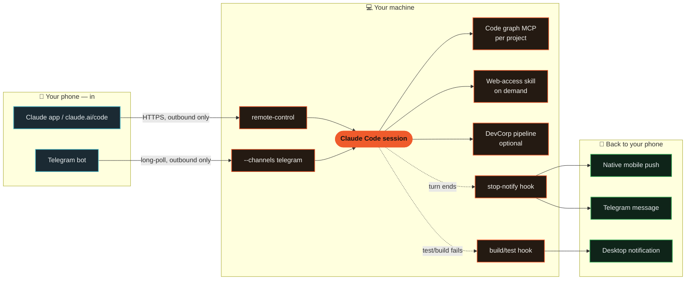

<p align="center">
  
</p>

<p align="center">
  <a href="./LICENSE"></a>
  <a href="https://code.claude.com"></a>
  <a href="./install.sh"></a>
  
  <a href="https://github.com/adro0303/overclaude/pulls"></a>
</p>

**[Claude Code](https://code.claude.com)'s ecosystem has a dozen good ideas scattered across a dozen separate repos. Overclaude is what happens when the best of them get evaluated, stripped down, and wired into *one* setup you install once — instead of five things you'd have to find, compare, and glue together yourself.**

That's the whole project: not a new tool, a curation. Every serious improvement people bolt onto Claude Code today lives in its own repo, with its own install steps and its own tradeoffs — and several of them solve the exact same problem twice. Overclaude is the result of actually doing that comparison — cloning the candidates, reading the code, benchmarking the claims — and shipping only the pieces that won, pre-wired to work together.

<p align="center">
  
</p>

| What it does | Powered by |
|---|---|
| 🧠 Codebase knowledge graph | [`codebase-memory-mcp`](https://github.com/DeusData/codebase-memory-mcp) — chosen over Graphify after both were cloned and benchmarked |
| 🌐 On-demand internet access | [`Agent-Reach`](https://github.com/Panniantong/Agent-Reach) — installed as a skill, not a standing MCP |
| 📱 Mobile app control | Claude Code's native **Remote Control** — no bot required |
| 💬 Telegram control | Claude Code's native **Channels** plugin — official, not custom-built |
| 🔔 Smart notifications | Original hooks in this repo, built after `tmux`/`Orca`-style orchestration was ruled out |
| 🏢 Multi-agent build pipeline | [`DevCorp`](./skills/devcorp) — original skill + 7 subagents, model-routed (haiku recon → sonnet build → opus plan/audit), optional install |
| 💛 Support nudge | **Opt-in, off by default.** One line/week, straight to your terminal, zero tokens — see "Support nudge" below |

Full evaluation notes — what else was considered, and why it lost — are in [`docs/`](./docs) and [`THIRD_PARTY_NOTICES.md`](./THIRD_PARTY_NOTICES.md).

## ⚡ Efficient: less context, fewer tokens, sharper answers

**Understand large codebases without reading them file-by-file.**
A local, zero-API-key code knowledge graph (tree-sitter + a persistent graph, not embeddings-as-a-service) answers structural questions — who calls this, what breaks if I change that, what's the architecture — in a few hundred tokens instead of tens of thousands. Scoped per project, never loaded globally, so it costs nothing in the projects that don't need it.

**Reach the parts of the internet Claude can't fetch natively.**
Native `WebFetch`/`WebSearch` stay the default for every generic page. A capability skill kicks in only for what they genuinely can't do: logged-in platforms, heavy-JS pages, video transcripts — installed as an on-demand skill, not a standing MCP tax on every session.

## 📱 Comfortable: leave it running, carry it in your pocket

<p align="center">
  
</p>

**Leave it running. Drive it from your pocket.**
Built entirely on Claude Code's *native* Remote Control and Channels features — no third-party bot server, no proxy, no exposed port. Close your laptop mid-task and approve permissions, read progress, and send new instructions from the official Claude mobile app, or a Telegram bot that only the people you name can talk to.

**Get pinged for what matters, not everything.**
One scoped hook watches for failed test/build commands and fires a desktop notification — not a ping for every tool call Claude makes, just the ones that actually need you.

**Know the moment it's done, wherever you are.**
A `Stop` hook fires a completion sound and a short Telegram message (with a preview of the last response) the instant a turn finishes. Combined with `agentPushNotifEnabled`, Claude can also push straight to the official mobile app's native notification channel once Remote Control is connected — no extra bot, no extra token, reuses the Telegram pairing you already did above.

**Zero-ceremony project switching.**
Two shell functions, `cproj` and `ctel`, turn "open this project and make it reachable from my phone" into one command instead of a memorized ritual of flags.

## 🤔 Why should you install this?

Every piece here had real competition, and Overclaude already ran the bake-off so you don't have to. A code-graph MCP, a way to talk to Telegram, a way to run multiple agents at once, a way to reach the API — each of those categories had several legitimate options, each option got cloned and actually tried, and only the one that won a head-to-head made it into this repo. Doing that yourself costs more than the five minutes `install.sh` takes — you just don't find out until later.

**You'd end up running two things that do the same job.** Whatever code-graph MCP you land on first, you'll eventually find a second one — and now both load their tool schema into every session, whether you're debugging a race condition or fixing a typo. Overclaude ships one, scoped to the project that actually needs it.

**You'd own a Telegram bot's security instead of Anthropic's.** Hand-rolling a bot means you're the one who decides how it stores tokens and who's allowed to talk to it. Overclaude uses Claude Code's official `Channels` plugin instead — a real request-ID and allowlist protocol Anthropic maintains, not a homemade one parsing chat text.

**You'd be staring at a tmux pane, not an answer.** A tmux-based multi-session setup can show you that a pane exists; it can't tell you whether the agent inside it is working, stuck waiting on you, or already done. Claude Code's native `--bg` sessions carry that state directly, so nothing's left guessing from a spinner.

**You wouldn't pay for the same tokens twice.** No Agent SDK bolted on the side billing a separate API key — everything here runs through the Claude Code CLI, on the subscription you already have.

**A sponsored message typed into your own terminal is opt-in, off by default, and never costs you a token.** `install.sh` asks — same y/N prompt as every other optional piece here, skipping it is exactly as easy as accepting it. Say yes and you get one line, at most once a week, written straight to your terminal device; say no (the default) and nothing changes. See "💛 Support nudge" below for exactly how and why it can't touch Claude's context.

None of that is a guess — every one of those was a real fork with more than one serious option on the table, and this is the side that won each time. Full writeups of the runners-up are in [`docs/`](./docs).

## 💛 Support nudge (opt-in, off by default)

`install.sh` has one more optional prompt: a one-line nudge to star or support the
project, at most once a week. It is **not installed unless you say yes**, and skipping
it is exactly as easy as accepting it — same `[y/N]` prompt as every other optional
piece in this repo.

If you enable it, here's exactly what happens, no more:

- It's a `SessionStart` hook (`hooks/support-notice`), same mechanism as the other
  hooks here.
- It writes one dim line straight to your terminal device — not to stdout. Claude Code
  reads a hook's stdout as JSON and can fold it into the model's context
  (`systemMessage` / `additionalContext`), which would cost tokens on every session —
  exactly what this repo exists to avoid. Writing to the terminal device directly skips
  that path entirely: Claude never sees the message, in any form, ever.
- It's rate-limited to once a week (a timestamp file in `~/.claude/`), so even enabled
  it isn't a tax on every session start.
- No third party is involved and no money currently changes hands — this is
  self-promotion for this specific repo, not paid placement. If that ever changes, it
  will say so here first.

To turn it off again: delete the `SessionStart` entry referencing `support-notice` in
`~/.claude/settings.json`, or just remove `~/.claude/hooks/support-notice`.

## 🧩 How skills get chosen: token cost is the filter

Every skill in this repo — [`Agent-Reach`](https://github.com/Panniantong/Agent-Reach) and the original [`DevCorp`](./skills/devcorp) — went through the same sweep: search the Claude Code skill ecosystem for candidates, then filter hard for what each one costs when it's *not* being used. A skill only earns a place here if it loads on demand, with zero fixed tool-schema tax on every session, and only if it actually beats what's already native or already installed. Anything that would add a standing cost, or just duplicate something Claude Code already does natively, gets cut before it reaches this repo.

<p align="center">
  
</p>

Same filter, applied one level up: it's why `codebase-memory-mcp` stays scoped per-project instead of registered globally (see [`CLAUDE.md.example`](./CLAUDE.md.example)), and why Agent-Reach only kicks in for platforms native `WebFetch`/`WebSearch` genuinely can't handle — logged-in sites, heavy-JS pages, video transcripts — never for a generic page or bare URL, even when the skill's own docs say "MUST USE".

**DevCorp, concretely — the same principle inside one skill:**

- **One model thinks, cheaper models type.** `dc-architect` runs on Opus once per task to make the actual plan — trade-offs, file-by-file task list. `dc-frontend`/`dc-backend` then execute that plan literally on Sonnet, and pure recon runs on Haiku. You pay the expensive model for judgment, not for typing out boilerplate it already decided on.
- **Caveman output between agents.** Subagents hand work back in four lines — `GOAL / FILES / CONSTRAINTS / DONE WHEN` — not prose. Full sentences are reserved for things a human actually reads: commits, PRs, security findings, the final summary to you.
- **Raw output never crosses back.** `dc-scout` might grep half the repo to find what it's looking for; only a `path:line` table returns to the orchestrator. The grep noise dies inside that subagent's own context instead of bloating yours.
- **Phases that don't apply get skipped, not run-and-shrugged.** A typo fix never spins up SPEC/ARCH/QA/SECURITY at all — those are calls that are never made, not calls made cheaply.

## 🏗️ Architecture



Nothing here opens an inbound port. Both mobile paths are outbound connections initiated by your machine or by Telegram's own servers polling your bot — there is nothing on the public internet pointed at your PC.

## 🚀 Quickstart

```bash
git clone https://github.com/adro0303/overclaude.git
cd overclaude
./install.sh
```

The installer is interactive and asks before touching anything optional. It always:
- Installs the build/test-failure notification hook
- Installs the turn-completion hook (sound + Telegram ping) and enables native mobile push notifications
- Wires `cproj` / `ctel` into your shell

It only installs the code-graph MCP, the internet-access skill, or DevCorp if you say yes, and it never overwrites your existing `~/.claude/settings.json` or `~/.claude/CLAUDE.md` — it merges in what's missing.

### Connect your phone (native Remote Control, zero setup)

```bash
cd ~/Projects/your-project
claude remote-control
```

Open the **Code** tab in the official Claude mobile app, or visit `claude.ai/code` — the session shows up automatically. Approvals, progress, and completion all surface natively in the app.

### Connect Telegram (optional)

1. Message [@BotFather](https://t.me/BotFather) on Telegram, send `/newbot`, copy the token.
2. `claude plugin install telegram@claude-plugins-official`
3. Inside a Claude Code session: `/telegram:configure <token>`
4. `claude --channels plugin:telegram@claude-plugins-official`
5. Message your bot from your phone — it replies with a pairing code.
6. `/telegram:access pair <code>`, then `/telegram:access policy allowlist` to lock it down to just the people you approve.

From then on, `ctel <project-name>` moves the bot to whichever project you're working on.

Once Telegram is paired, `hooks/stop-notify` (installed automatically) reuses that same pairing to ping you when a turn finishes — nothing further to configure. Native mobile push additionally reaches your phone once a session was started with `claude remote-control` / `cproj`; the `agentPushNotifEnabled` / `inputNeededNotifEnabled` settings the installer sets just allow Claude to use that channel, they don't create the connection by themselves.

## 🔧 Configuration reference

- [`CLAUDE.md.example`](./CLAUDE.md.example) — tool-preference rules to merge into your own `CLAUDE.md`
- [`hooks/build-test-alert`](./hooks/build-test-alert) — the build/test-failure notification hook, read it before you trust it
- [`hooks/stop-notify`](./hooks/stop-notify) — the turn-completion hook (sound + Telegram ping), read it before you trust it
- [`shell/aliases.zsh`](./shell/aliases.zsh) — `cproj` / `ctel`
- [`skills/devcorp/`](./skills/devcorp) — DevCorp pipeline skill + [`references/`](./skills/devcorp/references) (phase gates, checklists, token-budget rationale)
- [`agents/devcorp/`](./agents/devcorp) — the 7 subagents DevCorp routes to (`dc-scout` through `dc-security`), installed flat into `~/.claude/agents/`
- [`.env.example`](./.env.example) — the only environment variables this repo cares about

## 🔒 Security notes

- Nobody talks to the Telegram bot by default except the account that set it up (`dmPolicy: allowlist`, checked by sender ID, not chat/group ID).
- Anyone you *do* allow through the channel can approve or deny permission prompts in the session it's attached to — that's real control over what Claude does on your machine, not a read-only chat. Grant it accordingly.
- Secrets (the bot token) are never stored in this repo or in the hook script — they live in `~/.claude/channels/telegram/.env`, `chmod 600`, or your own shell environment.
- The notification hook only ever inspects the command string of a failed Bash call and prints a notification; it has no `allow`/`deny` authority and cannot approve anything.
- `hooks/stop-notify` sends a short (150-char) preview of Claude's last response over Telegram to whoever is already in your channel's `allowFrom` allowlist — know that before you approve someone through pairing, since it's more than the build/test hook shares. Set `TELEGRAM_NOTIFY_CHAT_IDS` to narrow it to a subset if you pair more people than you want reading completion previews.

## Acknowledgments

Overclaude configures and connects existing tools rather than reinventing them. Full credit and license details for everything it depends on are in [`THIRD_PARTY_NOTICES.md`](./THIRD_PARTY_NOTICES.md) — in short: [DeusData/codebase-memory-mcp](https://github.com/DeusData/codebase-memory-mcp) (MIT), [Panniantong/Agent-Reach](https://github.com/Panniantong/Agent-Reach) (MIT), and Anthropic's [claude-plugins-official](https://github.com/anthropics/claude-plugins-official) (Apache-2.0) and [Claude Code](https://code.claude.com) itself.

## License

MIT — see [`LICENSE`](./LICENSE). This covers the original code in this repository (hooks, shell scripts, docs); it does not relicense the third-party projects it installs.

---

If Overclaude got your Claude Code doing more with less, a star helps other people find it.
